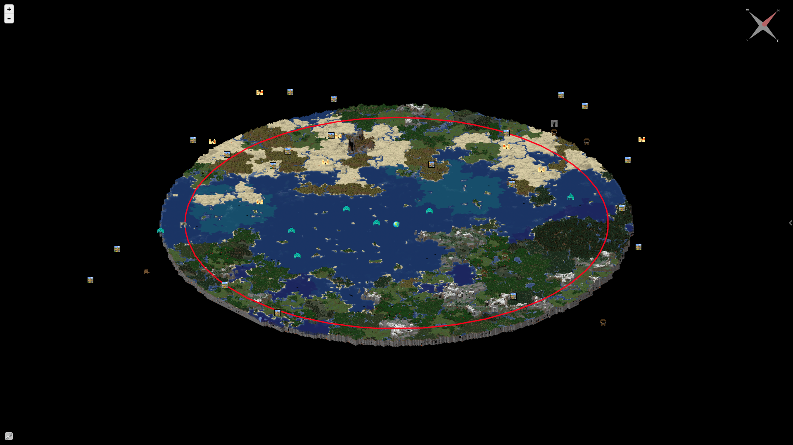

# dynmap-structures  

A Bukkit plugin that shows your world's structures (such as Villages, Strongholds, and Pyramids) on Dynmap.

## Features

* Adds markers to [Dynmap](https://dev.bukkit.org/projects/dynmap) where all structures are located.
* Currently supports the following structures in the following dimensions:
    * Overworld: [Buried Treasure](https://minecraft.gamepedia.com/Buried_Treasure), [Desert Pyramid](https://minecraft.gamepedia.com/Desert_pyramid), [Igloo](https://minecraft.gamepedia.com/Igloo), [Jungle Pyramid](https://minecraft.gamepedia.com/Jungle_pyramid), [Mineshaft](https://minecraft.gamepedia.com/Mineshaft), [Ocean Monument](https://minecraft.gamepedia.com/Ocean_Monument), [Ocean Ruins](https://minecraft.gamepedia.com/Ocean_Ruins), [Pillager Outpost](https://minecraft.gamepedia.com/Pillager_Outpost), [Ruined Portal](https://minecraft.gamepedia.com/Ruined_Portal), [Shipwreck](https://minecraft.gamepedia.com/Shipwreck), [Stronghold](https://minecraft.gamepedia.com/Stronghold), [Village](https://minecraft.gamepedia.com/Village), [Swamp Hut](https://minecraft.gamepedia.com/Swamp_hut), [Woodland Mansion](https://minecraft.gamepedia.com/Woodland_Mansion).
    * Nether: [Bastion Remnant](https://minecraft.gamepedia.com/Bastion_Remnant), [Nether Fortress](https://minecraft.gamepedia.com/Nether_Fortress), [Nether Fossil](https://minecraft.gamepedia.com/Nether_Fossil), [Ruined Portal](https://minecraft.gamepedia.com/Ruined_Portal).
    * End: [End City](https://minecraft.gamepedia.com/End_City).
* Configure which types of structures you would like to be shown.
* Localize or change the labels to anything you would like.
* Compatible with [Spigot](https://www.spigotmc.org), [Paper](https://papermc.io) and any other Bukkit compatible server with [Dynmap](https://dev.bukkit.org/projects/dynmap) installed. Also compatible with any [Forge](https://www.minecraftforge.net) based Bukkit compatible server with [DynmapForge](https://minecraft.curseforge.com/projects/dynmapforge) and [DynmapCBBridge](https://minecraft.curseforge.com/projects/dynmapcbbridge) installed.
* Multi-world compatibility with plugins such as [Multiverse](https://dev.bukkit.org/projects/multiverse-core) installed.

## Configuration

The **structures** node supports boolean values for the following keys:

**bastionremnant**

    If true, displays Bastion Remnants on your map. Default value is true.

**buriedtreasure**

    If true, displays Buried Treasures on your map. Default value is false.

**desertpyramid**

    If true, displays Desert Pyramids on your map. Default value is true.

**endcity**

    If true, displays End Cities on your map. Default value is true.

**fortress**

    If true, displays Nether Fortresses on your map. Default value is true.

**igloo**

    If true, displays Igloos on your map. Default value is true.

**junglepyramid**

    If true, displays Jungle Pyramids on your map. Default value is true.

**mansion**

    If true, displays Woodland Mansions on your map. Default value is true.

**mineshaft**

    If true, displays Mineshafts on your map. Default value is false.

**monument**

    If true, displays Ocean Monuments on your map. Default value is true.

**netherfossil**

    If true, displays Nether Fossils on your map. Default value is true.

**oceanruin**

    If true, displays Ocean Ruins on your map. Default value is true.

**pillageroutpost**

    If true, displays Pillager Outposts on your map. Default value is true.

**ruinedportal**

    If true, displays Ruined Portals on your map. Default value is true.

**shipwreck**

    If true, displays Shipwrecks on your map. Default value is false.

**stronghold**

    If true, displays Strongholds on your map. Default value is true.

**swamphut**

    If true, displays Swamp Huts on your map. Default value is true.

**village**

    If true, displays Villages on your map. Default value is true.

The **labels** node supports string values for the following keys:

**bastionremnant**

    If set, the label for Bastion Remnants on your map. Default value is Bastion Remnant.

**buriedtreasure**

    If set, the label for Buried Treasures on your map. Default value is Buried Treasure.

**desertpyramid**

    If set, the label for Desert Pyramids on your map. Default value is Desert Pyramid.

**endcity**

    If set, the label for End Cities on your map. Default value is End City.

**fortress**

    If set, the label for Nether Fortresses on your map. Default value is Nether Fortress.

**igloo**

    If set, the label for Igloos on your map. Default value is Igloo.

**junglepyramid**

    If set, the label for Jungle Pyramids on your map. Default value is Jungle Pyramid.

**mansion**

    If set, the label for Woodland Mansions on your map. Default value is Woodland Mansion.

**mineshaft**

    If set, the label for Mineshafts on your map. Default value is Mineshaft.

**monument**

    If set, the label for Ocean Monuments on your map. Default value is Ocean Monument.

**netherfossil**

    If set, the label for Nether Fossils on your map. Default value is Nether Fossil.

**oceanruin**

    If set, the label for Ocean Ruins on your map. Default value is Ocean Ruins.

**pillageroutpost**

    If set, the label for Pillager Outposts on your map. Default value is Pillager Outpost.

**ruinedportal**

    If set, the label for Ruined Portals on your map. Default value is Ruined Portal.

**shipwreck**

    If set, the label for Shipwrecks on your map. Default value is Shipwreck.

**stronghold**

    If set, the label for Strongholds on your map. Default value is Stronghold.

**swamphut**

    If set, the label for Swamp Huts on your map. Default value is Swamp Hut.

**village**

    If set, the label for Villages on your map. Default value is Village.

The **layer** node supports the following key-value pairs:

**name**

    A string that is used for the name of the layer. It is shown in the layer control UI element.

**hidebydefault**

    If true, the structures layer will be hidden by default.

**layerprio**

    An integer representing the layer priority in Dynmap.

**nolabels**

    If true, no labels will be shown for structures on the map.

**minzoom**

    The minimum zoom level where structures will be shown on the map.

**inc-coord**

    If true, coordinates will be included in the labels for structures.

You can also place a hash in front of any of the nodes to comment it out and disable it.

## Links

* Example: <https://d.kovuthehusky.com/dynmap-structures>
* Issues: <https://github.com/KovuTheHusky/dynmap-structures/issues>
* Source: <https://github.com/KovuTheHusky/dynmap-structures>
* Builds: <https://travis-ci.com/KovuTheHusky/dynmap-structures>
* Bukkit: <https://dev.bukkit.org/projects/dynmap-structures>
* Spigot: <https://www.spigotmc.org/resources/dynmap-structures.39534>
* Metrics: <https://bstats.org/plugin/bukkit/dynmap-structures>
